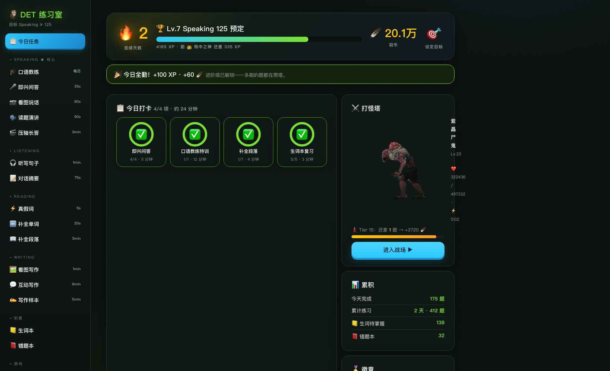
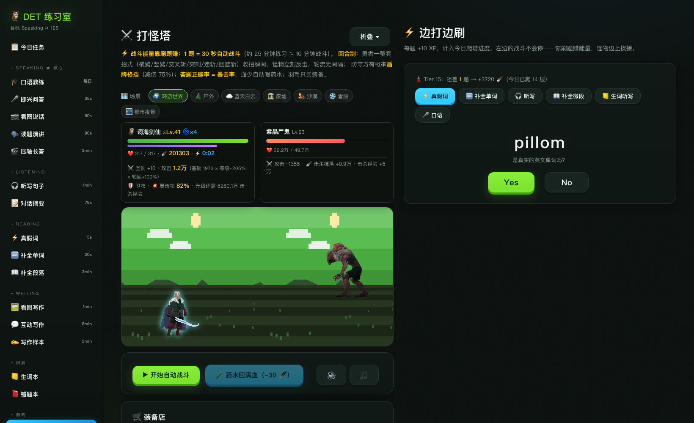

# DET 练习室 🦉 · DET Practice Arena

**简体中文** · [English](README.en.md)

**把 Duolingo English Test 备考变成一场 RPG。**

刷题赚能量 → 能量驱动自动战斗 → 击杀 BOSS 掉落金币 → 升级装备、爬塔、转生。每答对一道题，左边的勇者就替你多砍 30 秒——背单词从此变成打怪升级。

> 一个开源、可自托管的 DET 练习平台：12 个题型限时模拟、对标官方评分标准的 AI 评分与纠错、本地 Whisper 转写，外加一整套把刷题变成 RPG 的游戏系统。English README → [README.en.md](README.en.md).

## 🎬 实机演示


▶️ [观看高清完整视频（MP4）](docs/demo.mp4) — 夜城黑暗骑士、盾牌格挡、回旋斩暴击、场景昼夜切换，右侧全程同步刷题。

## 📸 截图

| 每日打卡仪表盘 | 边打边刷（战斗 × 刷题分屏） |
| :---: | :---: |
|  |  |

## 🎮 这游戏怎么玩

- **⚔️ 打怪塔**：回合制自动战斗——勇者使出横劈、竖劈、交叉斩、回旋斩，怪物冲刺反扑，盾牌格挡火花四溅。战斗时间只能靠做题赚：**1 题 = 30 秒**
- **60+ 个 BOSS**：哥布林、骷髅剑士、炎蟒、尸鬼、邪法师、鬼面武士、黑暗骑士、魔龙……每轮通关后全体换色进阶——苍蓝、紫晶、黄金、绯红、翠绿变体逐层登场
- **答题正确率 = 暴击率**：今天刷题越准，战场上刀刀暴击
- **装备与成长**：羽币商店升武器升防具（剑刃随等级换形换色）、战斗等级、称号阶梯（夜读学徒 → 词海剑仙）
- **🌀 轮回转生**：打到 25 层后可转生重来，保留战斗等级、永久伤害加成——无限后期循环
- **沉浸战场**：7 首芯片 BGM 击杀渐变切歌，行军穿越户外 / 蓝天白云 / 废墟 / 沙漠 / 雪原 / 都市夜景等程序生成场景
- **每日打卡**：任务圆环、连击、XP 等级、徽章墙——每天 15-30 分钟，雨露均沾所有题型

## 📚 练习功能

- **12 个 DET 题型限时模拟**：即兴问答（TTS 读题 + AI 自适应追问）、看图说话、读题演讲、压轴长答、听写句子、对话摘要、真假词、补全单词、C-test、看图写作、互动写作、写作样本
- **AI 评分对标官方标准**：评分体系基于 DET 官方评分指南的六项标准与分数段构建，对语音转写误差宽容，给出定段理由
- **荧光笔式纠错**：完整还原你的整段回答，错误处红色高亮、紧跟绿色正确表达——一眼看清每个问题
- **🎓 AI 口语教练**：每日特训——范文示范、结构句型拆解、关键词脱稿复述、限时作答、AI 点评与多版本改写
- **题目永不重复**：做过的题跨设备、跨刷新绝不再出现；题库见底时 AI 自动出新题
- **语音转写**：服务器端 faster-whisper，CPU 即可跑，Safari / Chrome 通吃
- **生词本 + 错题本**：错词自动收集、AI 讲解；全部进度跨浏览器同步

## 🏗 架构

```
index.html / style.css / app.js / data.js   纯前端（vanilla JS，零构建、零框架）
server.js          Node ≥18：静态文件 + API 代理
  POST /api/ai           → DeepSeek 兼容 API（key 服务端现读，绝不下发前端）
  POST /api/transcribe   → 本地 whisper 守护进程（127.0.0.1:8095）
  GET/POST /api/state    → data/profile.json（跨浏览器进度同步，单用户）
transcribe_daemon.py     faster-whisper base.en（int8，CPU 即可）
```

## 🚀 部署

```bash
# 1. 准备 AI key（DeepSeek 或任何兼容 /chat/completions 的服务）
echo "DEEPSEEK_API_KEY=sk-..." > /path/to/.env
echo "DEEPSEEK_MODEL=deepseek-chat" >> /path/to/.env
export DEEPSEEK_ENV_PATH=/path/to/.env

# 2. 转写服务（可选，不装则无法录音评分）
python3 -m venv whisper-venv && whisper-venv/bin/pip install faster-whisper av
whisper-venv/bin/python transcribe_daemon.py &

# 3. 启动
node server.js          # http://localhost:8090
```

录音依赖 HTTPS（浏览器限制）：建议 [Tailscale Serve](https://tailscale.com/kb/1242/tailscale-serve) 或任意反向代理。

## 🎨 素材致谢（均为 CC0 公有领域）

- 音效：[Kenney](https://kenney.nl) Impact Sounds / RPG Audio · [RPG Sound Pack](https://opengameart.org/content/rpg-sound-pack)（artisticdude）
- 粒子贴图：Kenney Particle Pack
- BGM：Juhani Junkala [5 Chiptunes (Action)](https://opengameart.org/content/5-chiptunes-action) + [4 Chiptunes (Adventure)](https://opengameart.org/content/4-chiptunes-adventure)
- 勇者：[Fantasy Warrior](https://luizmelo.itch.io/fantasy-warrior)（LuizMelo）；像素怪物：LuizMelo 各 CC0 包
- 动画 BOSS：Cethiel [Dragon](https://opengameart.org/content/dragon-fully-animated) / [Zombie - Fully Animated](https://opengameart.org/content/zombie-fully-animated)
- 背景、特效编排、程序化像素生成器为本项目原创

## 📄 License

代码以 [MIT](LICENSE) 开源。题库内容为本项目原创（非官方真题）；Duolingo English Test 是 Duolingo, Inc. 的商标，本项目与其无关联。
